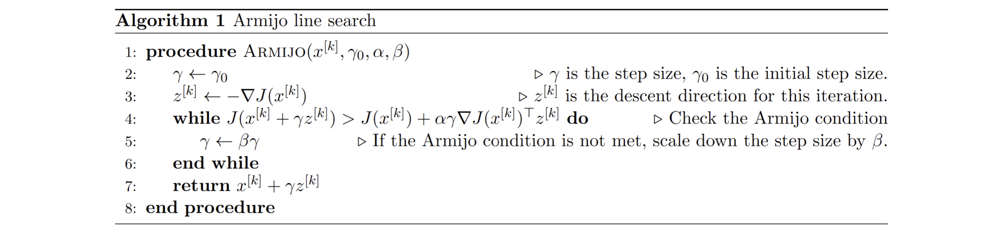

## Ergodic Search Agent
**Author: Jared Berry**

This project was associated with Northwestern University ME 455: Active Learning (Spring 2025).

#### Objective
The simulation environment was created by Max Muchen Sun, as a project template for MECH_ENG 455: Active Learning. It contains a sensor agent (robot) with 2d single integrator dynamics (controlled by velocity), a randomly generated box hidden from the robot, and a built-in prediction function that utilizes generative modeling techniques to predict possible box locations and dimensions given sensor reading history. 

The goal of this project was to control a robot to move across a space to collect signal measurements, such that the uncertainty (variance) of the box predictions drops below a predefine threshold as quickly as possible.

#### Algorithm Overview
The main algorithm is ergodic search, which is performed with iLQR. Ergodic control allows an agent to achieve comprehensive coverage of a search space, and aligns an agent's time spect in a given region with the density of information contained within that region. The agent takes binary samples within the sensor bounds, with a positive reading signifying the presence of the hidden box and a negative reading showing the opposite. Before receiving a certain threshold of positive readings, the agent plans an ergodic trajectory using an Iterative Linear Quadratic Regulator (iLQR). The agent completely finishes each planned trajectory before planning another. After receiving a certain threshold of positive readings, the agent then switches to an information maximization approach to eliminate uncertaity in the box's edges.

Step 1: Check positive sensor reading threshold and determine search state.

Step 2: Turn predicted boxes into a "target" distribution
      
&nbsp;&nbsp;&nbsp;&nbsp;&nbsp;&nbsp;a: Use negative/positive sensor readings (based on search state)

&nbsp;&nbsp;&nbsp;&nbsp;&nbsp;&nbsp;b: Create pdf based on sample locations with Kernel Density Estimation (KDE)

Step 3: Recalculate Fourier coefficients of target distribution

Step 4: Plan control signal for next time step based on search state
      
&nbsp;&nbsp;&nbsp;&nbsp;&nbsp;&nbsp;a: Positive sensor reading threshold not reached

&nbsp;&nbsp;&nbsp;&nbsp;&nbsp;&nbsp;&nbsp;&nbsp;&nbsp;&nbsp;&nbsp;&nbsp;i. If an ergodic trajectory isn't already planned, use iLQR to plan one. 

&nbsp;&nbsp;&nbsp;&nbsp;&nbsp;&nbsp;&nbsp;&nbsp;&nbsp;&nbsp;&nbsp;&nbsp;ii. If ergodic trajectory is planned, follow it.

&nbsp;&nbsp;&nbsp;&nbsp;&nbsp;&nbsp;b: Positive sensor reading threshold reached

&nbsp;&nbsp;&nbsp;&nbsp;&nbsp;&nbsp;&nbsp;&nbsp;&nbsp;&nbsp;&nbsp;&nbsp;i. If trajectory isn't planned, plan route to corner with most amount of variance in
               its possible location.

&nbsp;&nbsp;&nbsp;&nbsp;&nbsp;&nbsp;&nbsp;&nbsp;&nbsp;&nbsp;&nbsp;&nbsp;ii. If trajectory is planned, follow it.

Step 5: Save planned control signal and send to gym simulation function.

#### iLQR Description
iLQR is a technique used for solving boundary value problems (BVPs), which are common in optimization and optimal control. It requires a differentiable objective function, dynamics, and boundary conditions. This ergodic search algorithm uses iLQR, followed by Armijo line search to optimize the step size. The iLQR algorithm is as follows: 

```
ALGORITHM iLQR:
  Init J(u)                     # Objective function
  Init f(x, u) , x(0) = x_0     # Dynamics 
  Init (x_0, u_0)               # Initial conditions
  i = 0
  WHILE DJ(u) @ v > epsilon     # v represents the descent direction, @ is the dot product
      v_i(t) = argmin(DJ(u) @ v + 0.5 * v.T @ v)

      <armijo_line_search>

      u_i+1(t) = u_i(t) + gamma*v_i(t)
  ENDWHILE
END.
```

The following is a description of the Armijo line search. Note: This image is part of the course materials of ME 455: Active Learning at Northwestern University, taught by Dr. Todd Murphey and Max Muchen Sun.



#### Ergodic Control Description
In this algorithm, iLQR is used to plan an ergodic trajectory by using an objective function based on the ergodic metric. The descent direction is found by solving the following optimization problem:

\begin{align}
v(t)^{[k]} = \arg \min_{v(t)} \, 
& \int_0^T 
\underbrace{D_1 l(x(t)^{[k]}, u(t)^{[k]}) \cdot z(t)}_{a_x(t)} 
+ \underbrace{D_2 l(x(t)^{[k]}, u(t)^{[k]}) \cdot v(t)}_{b_u(t)} \, dt 
+ \underbrace{Dm(x(T)^{[k]}) \cdot z(T)}_{p_1} \notag \\
& \quad + \int_0^T z(t)^\top Q_z z(t) + v(t)^\top R_v v(t) \, dt, \tag{5}
\end{align}

\text{where } z(t) \text{ and } v(t) \text{ are governed by the following linear dynamics:}
\begin{align}
z(t) = 
\underbrace{z_0}_{z_0 = 0} + \int_0^t 
\underbrace{D_1 f(x(\tau)^{[k]}, u(\tau)^{[k]}) \cdot z(\tau)}_{A(\tau)} + 
\underbrace{D_2 f(x(\tau)^{[k]}, u(\tau)^{[k]}) \cdot v(\tau)}_{B(\tau)} \, d\tau. \tag{6}
\end{align}